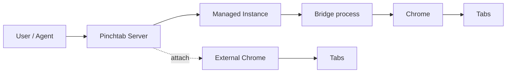
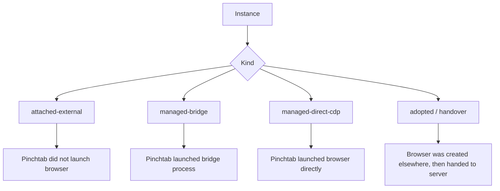
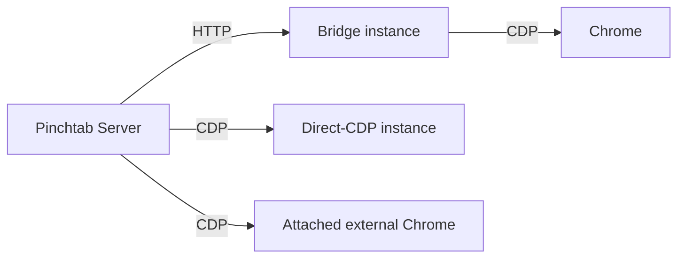
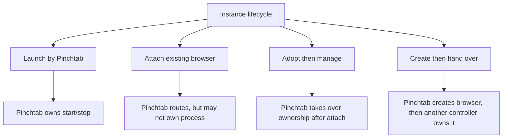
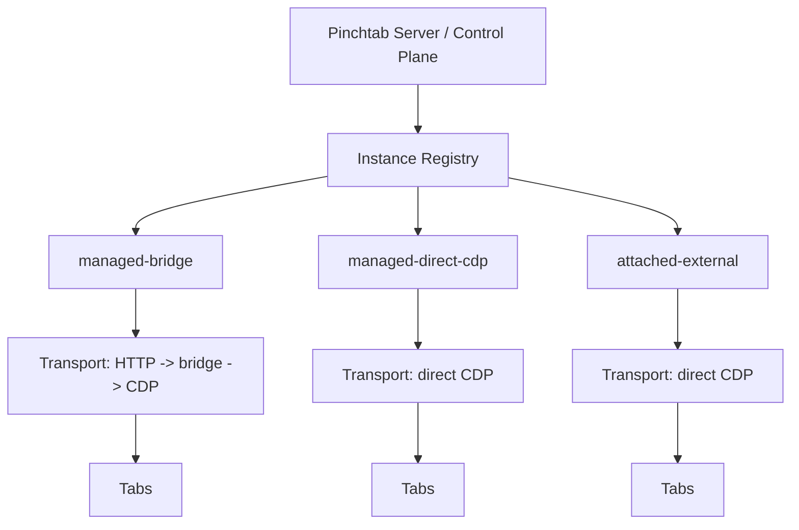

# Instance Model Charts

This page collects the visual mental model for Pinchtab instances.

It complements:
- [Architecture](pinchtab-architecture.md)
- [Managed Bridge vs Managed Direct-CDP](managed-bridge-vs-managed-direct-cdp.md)

## Chart 1: Current High-Level Model

## Chart 2: Instance Kinds

## Chart 3: Communication Paths

## Chart 4: Lifecycle Ownership

## Chart 5: Recommended Taxonomy

## Recommended Reading Of These Charts

The cleanest interpretation is:

- `source` answers who introduced the instance
- `runtime` answers how Pinchtab reaches the browser
- `ownership` answers who controls lifecycle

For the current architecture, the useful combinations are:

- `managed + bridge + pinchtab`
- `attached + direct-cdp + external`

And the main future option is:

- `managed + direct-cdp + pinchtab`
