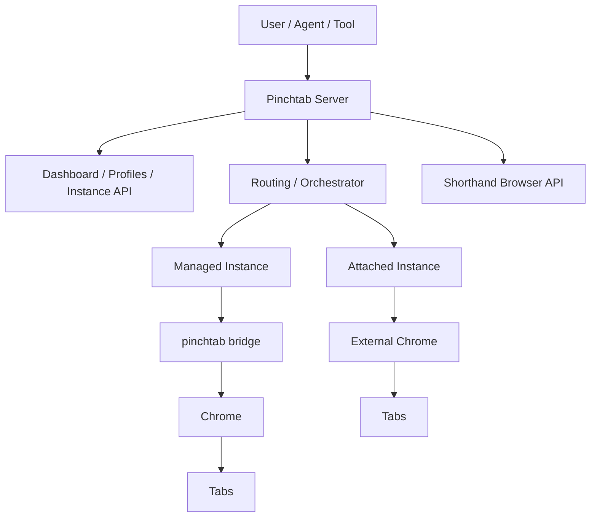
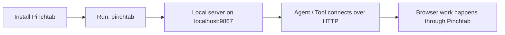
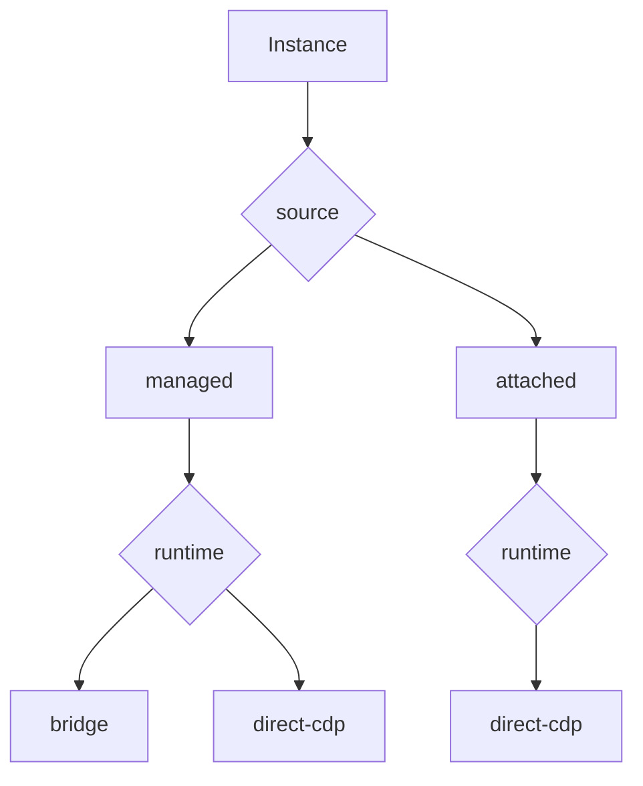
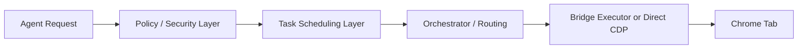
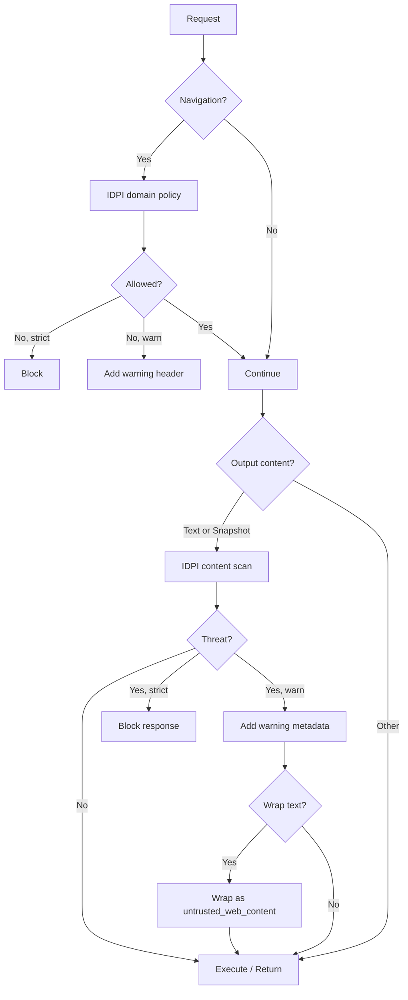
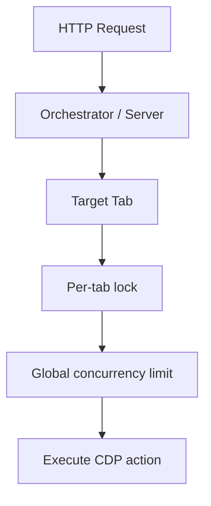
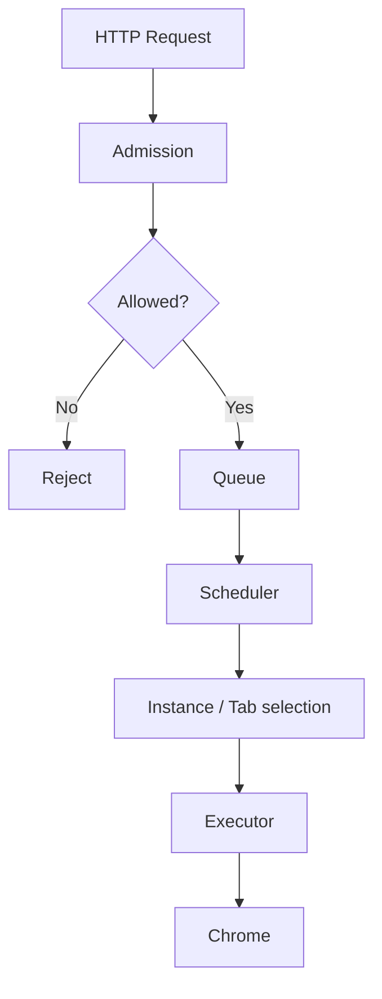

# Overall System Chart

This page gives the full mental model of Pinchtab in one place.

It combines:
- the primary user path
- the server/bridge runtime split
- managed vs attached instances
- current routing and execution
- current security layer and future scheduling layer

## Chart 1: Overall Product Shape

## Chart 2: Primary Usage Path

This is the primary user journey.

The normal user should think:
- install Pinchtab
- run `pinchtab`
- point the client at `http://localhost:9867`

They should not need to think about `pinchtab bridge` directly.

## Chart 3: Runtime Types

Interpretation:
- `source` = who introduced the instance
- `runtime` = how the server reaches the browser

## Chart 4: Current And Future Execution Layers

Meaning:
- **Policy / Security** decides whether a request should be admitted or sanitized
- **Task Scheduling** decides when and where admitted work should run
- **Orchestrator / Routing** decides which instance/tab path is used
- **Executor** performs the actual tab work

Today:
- execution exists
- routing exists
- security exists as a real IDPI defense layer
- scheduling is still mostly direct execution plus concurrency control

## Chart 4A: Current Security Layer

Current implementation shape:

- navigation checks happen before the tab opens or re-navigates
- content scanning happens on `/text` and `/snapshot`
- text wrapping is applied to `/text` output when enabled
- strict mode blocks, warn mode annotates

## Chart 5: Current Execution Model

This is the current model already present in the product:
- per-tab sequential execution
- bounded cross-tab parallelism
- direct request execution

That means the current architecture already has:

- a **security layer** for admission and output safety
- an **execution layer** for concurrency correctness

What it does not yet have as a first-class subsystem is:

- a true **task scheduling layer** with queued work, fairness, and dispatch policy

## Chart 6: Recommended Future Model

This is the cleaner model for multi-agent and parallel execution:
- requests become tasks
- tasks are admitted or rejected
- admitted tasks are queued
- the scheduler chooses what runs next
- existing executors still enforce per-tab correctness

## Reading Guide

Use the charts like this:

- **Chart 1** for the product overview
- **Chart 2** for onboarding and default usage
- **Chart 3** for instance taxonomy
- **Chart 4** for control-plane layering
- **Chart 5** for how execution works today
- **Chart 6** for the likely future scheduling architecture

## Related Docs

- [Architecture](pinchtab-architecture.md)
- [Instance Model Charts](instance-model-charts.md)
- [Managed Bridge vs Managed Direct-CDP](managed-bridge-vs-managed-direct-cdp.md)
- [Expert Guide: Attach](../guides/expert-attach.md)
- [Expert Guide: Multi-Instance Strategies](../guides/expert-strategies.md)
